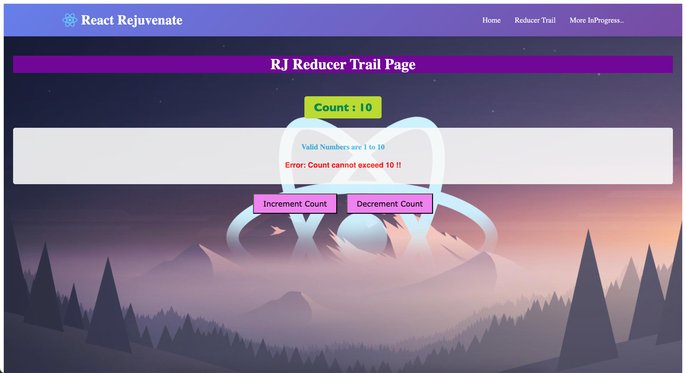

# React Basics Rejuvenation 🚀

## Overview
This project is dedicated to refreshing and reinforcing my **React fundamentals and core concepts**. I'm revisiting key topics to strengthen my understanding and stay current with best practices.

---

## Setup & Installation

### Prerequisites
- Node.js (v14+)
- npm or yarn

### Installation Commands
```bash
# Install dependencies
npm install

# or using yarn
yarn install
```

---

## Development Commands

### Running the Project
```bash
# Start development server
npm start

# or with yarn
yarn start
```

### Building for Production
```bash
# Create optimized production build
npm run build

# or with yarn
yarn build
```

### Running Tests
```bash
# Run test suite
npm test

# or with yarn
yarn test
```

### Eject Configuration (⚠️ irreversible)
```bash
# Expose all configuration files
npm run eject
```

---

## Topics Covered

<!-- ### 1. Component Fundamentals


- Functional vs Class Components
- JSX Syntax
- Component Reusability

### 2. State & Props


- Managing component state with `useState`
- Passing data through props
- Prop drilling and alternatives

### 3. Hooks


- `useState` for state management
- `useEffect` for side effects
- `useContext` for context API
- Custom hooks

### 4. Event Handling


- Handling user interactions
- Event binding and delegation
- Form handling

### 5. Routing & Navigation


- React Router setup
- Route parameters -->
- Navigation between pages

### 1. State Management


<!-- - Context API -->
- useReducer hook
<!-- - Introduction to Redux -->

---

## Project Structure
```
react-basics-rejuvenation/
├── src/
│   ├── components/
│   ├── hooks/
│   ├── pages/
│   ├── App.js
│   └── index.js
├── public/
├── images/
│   ├── components.png
│   ├── state-props.png
│   ├── hooks.png
│   ├── events.png
│   ├── routing.png
│   └── state-management.png
└── package.json
```

---

## Learning Resources
- [Official React Documentation](https://react.dev)
- [React Patterns](https://reactpatterns.com)
- [Hooks API Reference](https://react.dev/reference/react)

---

## Progress Tracking
Track your progress by updating the image references in the `./images/` folder as you complete each topic.

---

## Notes
- Focus on understanding concepts deeply rather than just completing tasks
- Practice by building small projects for each topic
- Review and refactor previous code regularly

Happy Learning! 📚
